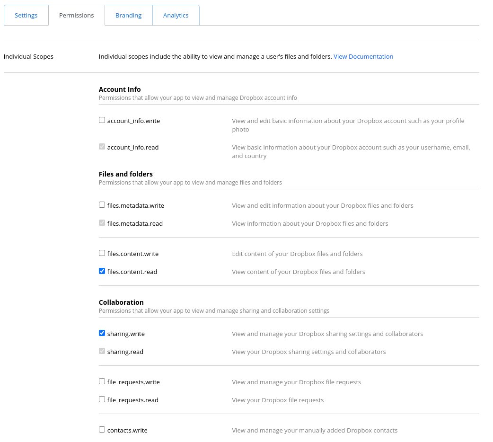

# rocketnotion
Service for Rocketbook-Notion integration
## Setup to test notebook
* create new virtualenv
```bash
   $ virtualenv .venv
```

* activate virtualenv
```bash
   $ source .venv/bin/activate
```

* load dependencies
```bash
   $ pip install -r requirements.txt
```

* Set DROPBOX_TOKEN to your Dropbox API key. You can create your personal Dropbox API [here](https://www.dropbox.com/developers/apps). It should have following permissions:


* launch app
```bash
   $ uvicorn main:app
```
* `Notion Token` is obtained from cookie file from your notion workspace
* `Dropbox folder` is a folder where your `.jpg` lecture notes are
* `Add Notebook` should be provided a link to your notion notebook(page)
