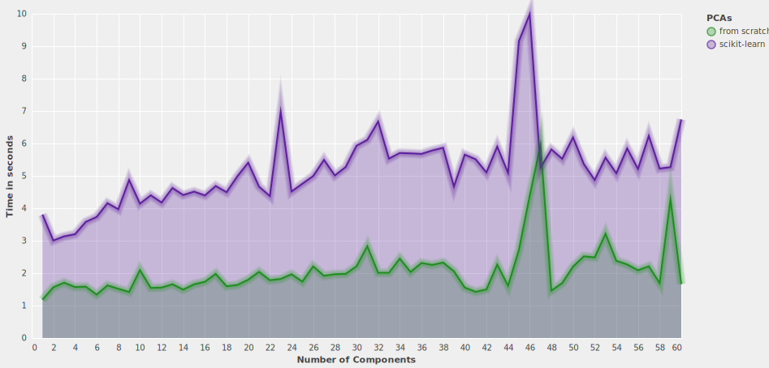
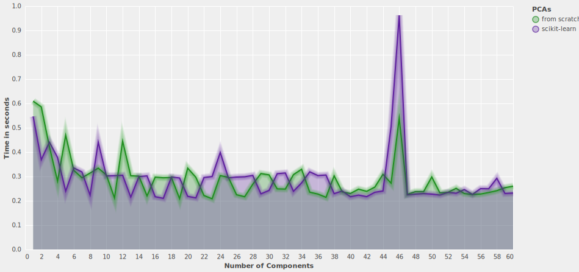
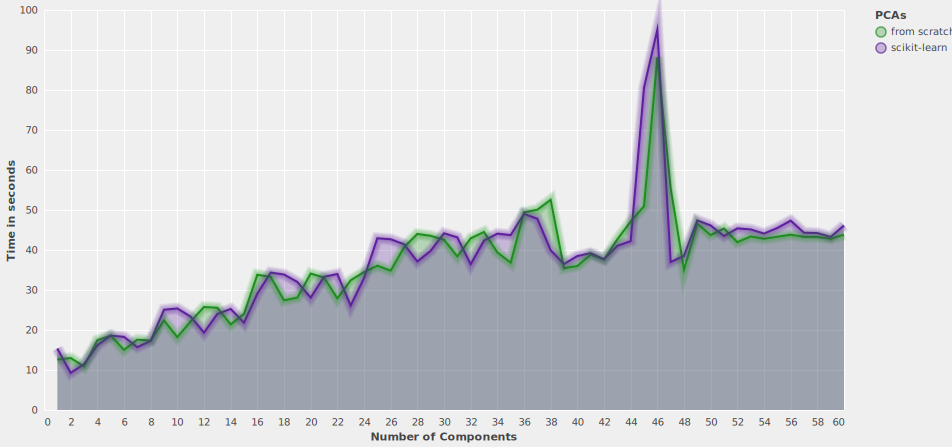
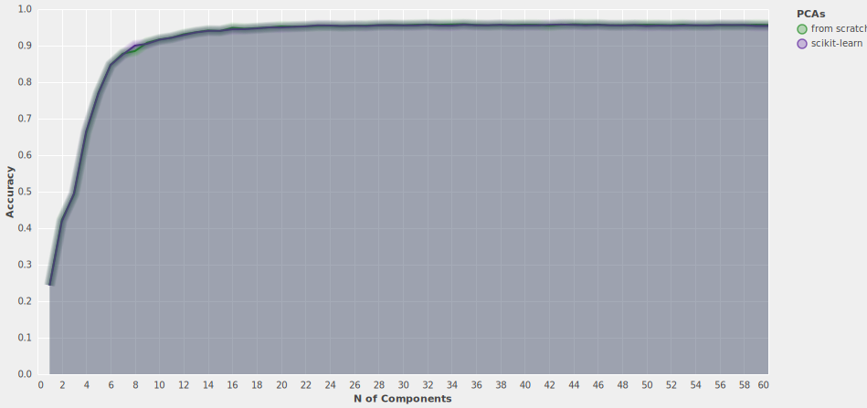
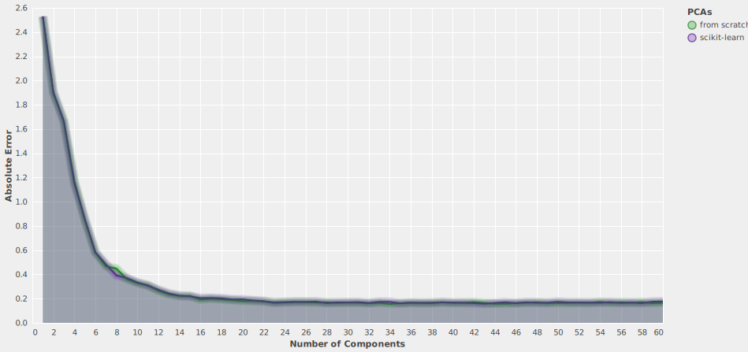
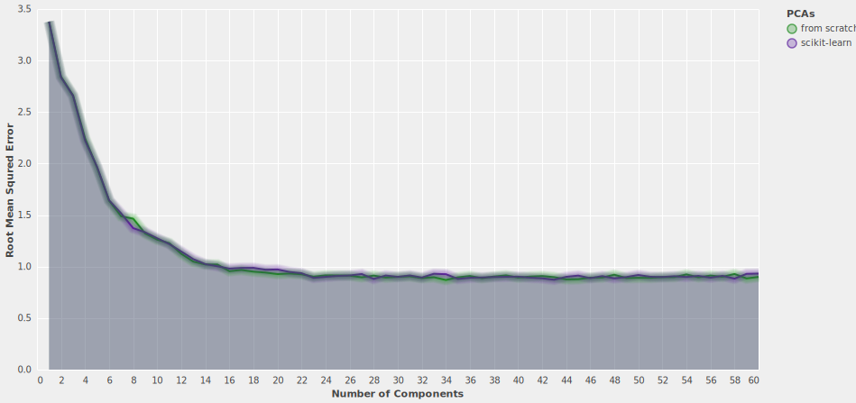

## PCAs' <ins>transformation</ins> time

## Classifier's <ins>testing</ins> time

## Classifier's <ins>training</ins> time

## Classifier's <ins>accuracy</ins>

## Classifiers' <ins>Absolute Error</ins>

## Classifier's <ins>Mean Squred Error</ins>

## Classifier's <ins>Root Mean Squred Error</ins>

